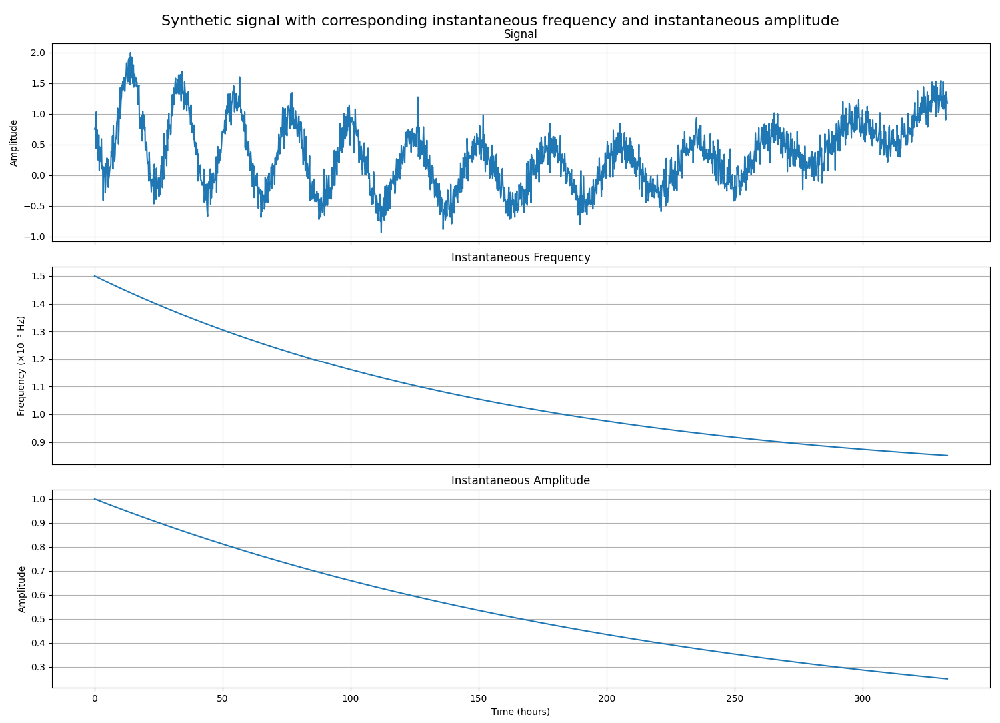
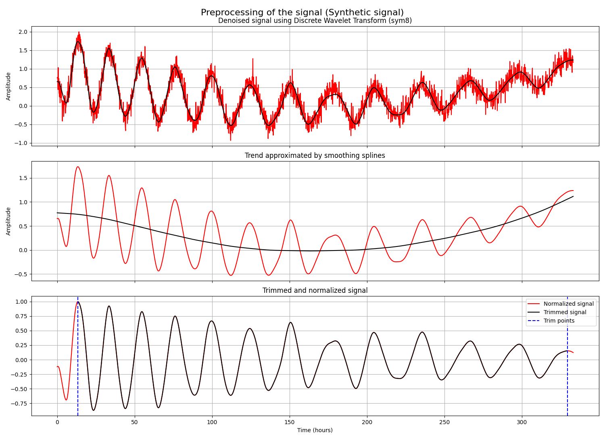
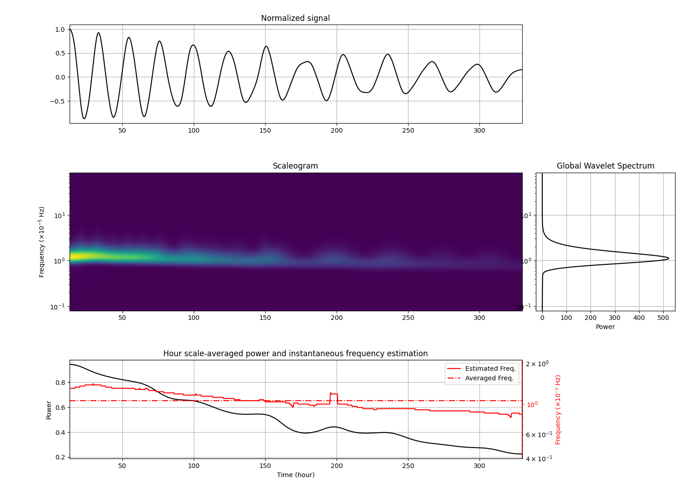
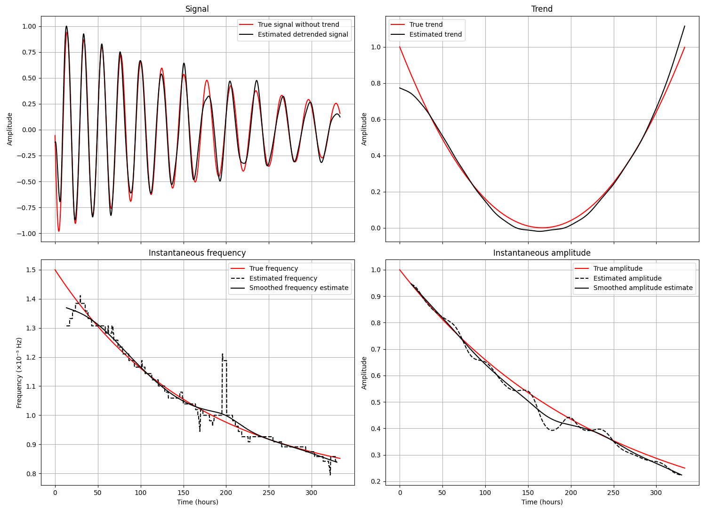

# Instantaneous frequency and amplitude estimation using Continuous Wavelet Transform

## Installation

Install the required dependencies:

```bash
pip install -r requirements.txt
```

## Overview
This repository implements the method described in the ***paper*** [3] for estimating the **instantaneous frequency and amplitude** of non-stationary oscillatory signals using the **Continuous Wavelet Transform (CWT)** (Mallat, 1999 [8]) and/or the **Synchrosqueezed Wavelet Transform** (Daubechies et al. 2011 [2], OverLordGoldDragon, ssqueezepy [1]). 
The mathematical details of the approach are provided in the ***paper*** [3].

The method is designed for long-oscilating time-series data such as circadian rhythm recordings, where:

- signal amplitude decays over time,
- non-stationarity complexifies Fourier analysis,
- low-frequency oscillations (approximately 24h period) make trend/oscillation separation difficult.

To address these kind of signals, we use a wavelet-based time-frequency framework combined with tailored preprocessing.

## Method summary

### Preprocessing

The raw signal is processed as follows:

#### 1. Denoising
This project uses wavelet-based denoising with the Discrete Wavelet Transform (DWT) with hard thresholding (Donoho et al. (1994) [4]) allowing high-frequency noise to be removed while preserving the oscillatory structure of the signal with minimal user inputs.

We use the Symlet wavelet *sym8* for denoising because it provides:
- near-symmetry, reducing phase distortions,
- sufficient smoothness for biological oscillatory signals,
- compact support and good localization properties,
- robust separation between noise and low-frequency oscillatory components.

Users can choose other wavelet more suitable to their signal.

#### 2. Detrending
Spline smoothing was applied following the approach described by Hastie et al. (2009) [5] to remove the low-frequency trend of the signal. 
A high regularization parameter ($\lambda = 5 \times 10^5$) was used due to the long duration and low-frequency nature of the signals.
This parameter can be changed depending to user's need.

#### 3. Trimming
Edge trimming is applied to remove signals' artifacts induced by experimental protocol. 
The trimming points are manually selected by the user at a signal peak. 
This step improves the assumption of local stationarity required for wavelet analysis (Torrence et al., 1998 [10]) and using a mirror padding allows us to minimise edges effects.

### Instantaneous frequency and amplitude estimation using the synchrosqueezed wavelet transform

In order to extract quantitative features of oscillating biological signals, we use a signal processing method based on Synchrosqueezed Wavelet Transform (SST) (Daubechies et al. 2011 [2]) using the generalised Morlet wavelet (Martinez et al. 2022 [9]).

We compute the CWT using the Generalized Morse wavelet (Lilly et al. 2012 [7]) from the *ssqueezepy* package [1], with parameters $\gamma = 3$ and $\beta = 2$.
The previous trimming step helps avoid edge-reflection artifacts that arise when using reflective padding at the signal boundaries during the CWT.
The resulting CWT coefficients are then synchrosqueezed (Daubechies et al. 2011 [2]) to improve the time-frequency resolution.
The ridges extraction from the SST allows to track local maxima of the synchrosqueezed energy over time.
The frequencies associated with this ridge provide an estimate of the signal's instantaneous frequency.
Finally, the instantaneous amplitude is obtained by evaluating the magnitude of the CWT coefficients along the extracted ridge.

## Example

In the file `example.py` a synthetic signal is generated with decreasing instantaneous frequency and amplitude.



The signal is then preprocessed using the methods described above.



The figure below illustrates the time-frequency analysis of the preprocessed signal. 
The top panel shows the normalized signal. 
The middle panel displays the scaleogram of the signal.
The panel on the right shows the Global Wavelet Spectrum. 
Finally, the bottom panel presents the evolution of the signal power together with the estimated instantaneous frequency.



We compare the true characteristics of the signal with those estimated by our method, including the trend, instantaneous frequency, and instantaneous amplitude.




## Implementation details

### File functions_InSync.py

Core library containing the main functions.

The functions are organized into the following sections:

- preprocessing,
- computation of the CWT,
- visualization tools.


### File example.py
Example illustrating the use of the library.

The script:

- generates a test signal,
- preprocesses the signal,
- computes the CWT,
- compares the true and estimated instantaneous frequency and amplitude.

# References


[1] OverLordGoldDragon. ssqueezepy: synchrosqueezing toolbox.  
https://github.com/OverLordGoldDragon/ssqueezepy

[2] I. Daubechies, J. Lu, and H. Wu (2011). 
Synchrosqueezed wavelet transforms: An empirical mode decomposition-like tool.

[3] ***citer article***

[4] D. L. Donoho, I. M. Johnstone (1994).  
Ideal spatial adaptation by wavelet shrinkage. 

[5] T. Hastie, R. Tibshirani, J. Friedman (2009).  
The Elements of Statistical Learning. Springer.

[6] D. Iatsenko, P. V. E. McClintock, A. Stefanovska (2015). 
On the extraction of instantaneous frequencies from ridges in time-frequency representations of signals.

[7] J. M. Lilly, S. C. Olhede (2012). 
Generalized Morse Wavelets as a Superfamily of Analytic Wavelets.

[8] S. Mallat (1999). 
A wavelet tour of signal processing.

[9] E. A. Martinez-Ríos, R. Bustamante-Bello, S. Navarro-Tuch, and H. Perez-Meana (2022). 
Applications of the generalized morse wavelets: A review.

[10] C. Torrence, G. P. Compo (1998).  
A Practical Guide to Wavelet Analysis.
